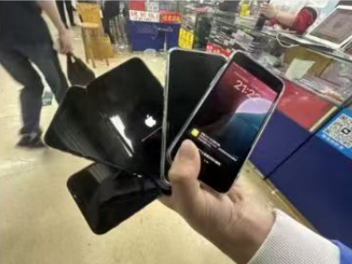
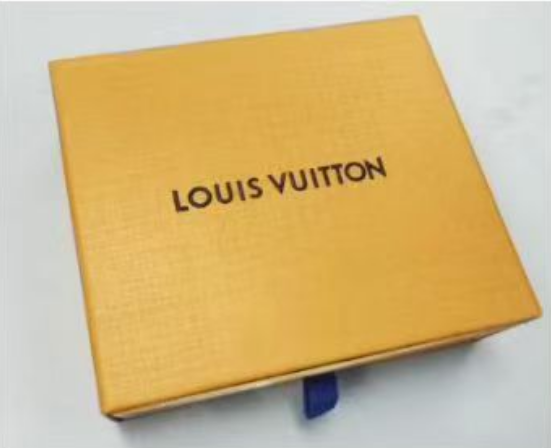
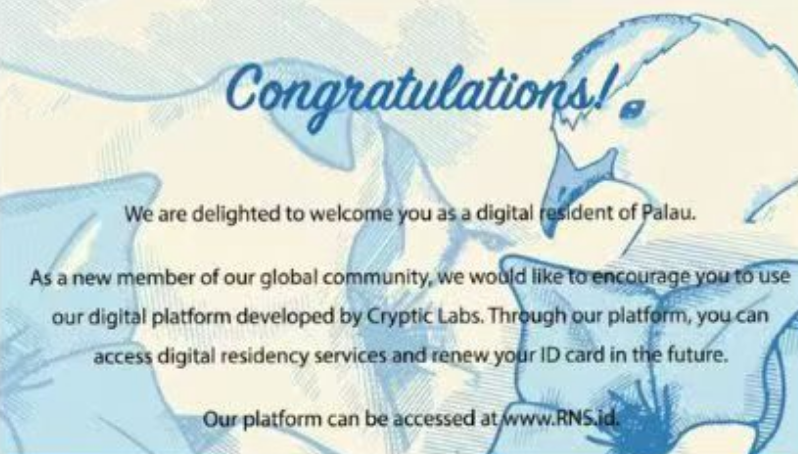
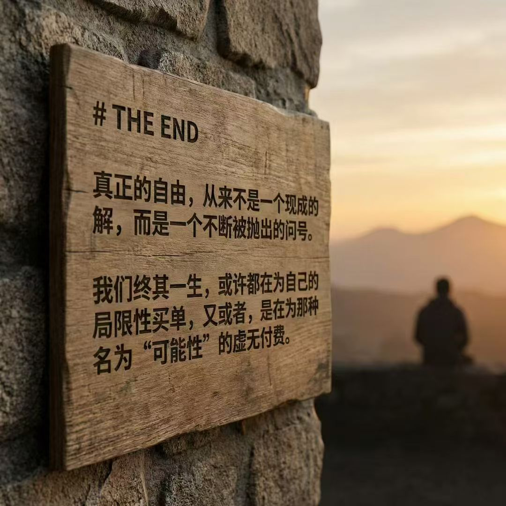

## Chapter 0: 前序

距离上次发随笔，大概过去了一年。当时的不知从何下笔，和现在也差不多。不过，这次算是有个模糊的方向。我知道这不仅是一篇新的文章，更是对上一篇随笔的续写——是时候 update 一下了。这篇文章里有对过去一年的总结反思，也有对一年前随笔的一次、不算回答的回答。它不会是终点，也不会是某种严谨的总结，或许更像是一张留给未来自己的备忘录。它的意义，可能要在某个时间节点，才会被重新理解。

------

## Chapter 1: 从暑假至今回望

一年前，写下那篇随笔时，我正站在一个风口。那时候的状态非常割裂。线上，事业稳定增长，一切都在轨道上，不需要我承担过多的压力。但在现实里，我被备战中考的日子搞得身心俱疲。那段时间，我真是被全日制课外班“硬控”的。卧槽你们能想象吗？早上七点半起，上到晚上十点五十（明面上），实际上还总是拖堂到十一点半。我明明在一个世界拥有了很多，却在另一个世界的教室里寸步难行。这其中我也跟全日制斗智斗勇过，但这里我懒得细说了。

结果算不上完美，但也勉强挤进了一所深圳的公办高中。直到暑假结束，踏入新校园的那一刻，我突然发觉——我几乎自由了。相对于全日制时期的窒息，这种久违的松弛感，让我终于有时间去做更多的事。而接下来的故事，几乎全部发生在这段“后中考”的时间里——从那个夏天，一直到现在。

------

## Chapter 2: 报复性填补

踏入高中的那种“自由”，最直接的反应就是失重。没人管我了，或者说，没人能管得住我了。在学校里，我并不是孤岛。我结识了一两个朋友——那种真的愿意听我说话的人，而不是只会点头的 NPC。我也收获了一些崇拜，毕竟在同龄人眼里，我的成就足够耀眼。但这并没有解决问题。那种熟悉的空虚感，像个幽灵一样又回来了。

于是，我选择了最简单的多巴胺获取方式：买。既然我有钱，既然我有时间，既然没有了全日制的束缚，我就开始报复性消费。几乎所有我能想象到的、且现有条件允许我去干的事，我都试了一遍。所有我想买的东西，只要能下单的，我都买了一遍。我以为物质能填满那个坑。结果？拆快递的那一瞬间是很爽，但下一秒，空虚感不仅没少，反而因为阈值的提高变得更重了。

------

## Chapter 3: 所谓“目标”

既然消费无法填补，那一定是缺乏一个宏大的目标。人总得有个奔头，对吧？于是我给自己立了一个听起来很吓人的 Flag：从 16 岁开始，把之前的积累清零（心态上），从 0 存款开始攒钱。截止日是 18 岁成年那天。目标金额：全款拿下一辆百万级豪车——保时捷 911，或者宝马 M4，哪怕是迈巴赫。然后把剩下的几十万拿去环游世界。

这听起来很热血，很符合世俗对于“年少有为”的定义。我真的开始执行了。每天计算收支，看着账户里的数字以此为目标增长，那种久违的“进度条感”似乎让我找到了一点活着的实感。

------

## Chapter 4: 庸俗的路径

但没过多久，我突然觉得不对劲。我看着那个“买车+环游世界”的计划，越看越觉得别扭。这也太 Low 了。太世俗了。这不就是所有暴发户、网红、或者所谓“成功人士”的标配路径吗？如果我努力了两年，仅仅是为了拥有一台工业流水线上的铁皮，为了去几个网红景点打卡发朋友圈，那我和我曾经鄙视的那些 *all show and no go* 的人有什么区别？这种目标，太容易被定义，也太容易被复制。它配不上我感受到的那种虚无。

------

## Chapter 5: 资本与新赛道

虽然觉得买车环游世界很俗，但攒钱这件事，永远是绝对正确的真理。我并没有把那个“18岁提保时捷/M4/迈巴赫”的计划砍掉，每周的定投还在继续。只不过，这不再是我唯一的关注点了。

我开始反思，自己到底是怎么走到今天这一步的。靠运气？靠技术？还是靠信息差？为了验证某些想法，我开启了一场新的冒险——进军一条全新的赛道。这一次的玩法，和以前完全不同。以前我是没钱，只能靠技术硬顶，抠抠搜搜地做优化。但现在，资金成了我的杠杆。我直接带资进组。钱砸进去，设备、资金池、体量，一进场就是业内前十的标准。至于那些繁琐的技术细节？我懒得自己动手了，直接雇人。专业的活让专业的人干，我只负责出钱和把控方向。

我现在一边在实战中补习这个行业的相关知识，一边操盘整个运营。目前还在起步期，还没看到最终的结果。但这感觉对了——比起单纯的消费，这种用资本构建系统的过程，才是我熟悉的节奏。至于后面会发展成什么样？我不知道，走着瞧吧。

------

## Chapter 6: 身份与围墙

在 Money 之上，我十分想出国。原因很简单：国外的环境更自由，也更好。这里无需赘述，DDDD，我也懒得赘述。有句老话叫“落叶归根”，我不那么认为。我认为哪舒服就在哪待着，这是我的自由。如果要说，那应该是“落叶生根”。但出国学习、生活、工作，需要身份，更需要 Money。

我现在已经是一个合法的帕劳数字居民了，但这还远远不够。

16 岁这个年纪，对于申请正式身份是不可能的。只能等我 18 岁以后。但到时候，我面临的是一个巨大的 *Unknown*：究竟是在国内买车，提一辆保时捷 911、宝马 M4 或者迈巴赫，过那种世俗的舒适生活？还是花很多钱去搞定身份问题，去一个发达国家从头开始？甚至，可能最后花了很多钱，但依旧原地踏步，落得一场空？

*Unknown*，我很难抉择。

------

## Final Chapter: 粗糙的闭环

这篇随笔写到这，该收尾了。回看开头，我说这是对去年那篇随笔“不算回答的回答”。但讽刺的是，这篇所谓的“年终总结”，从大脑构思、敲击键盘，再到丢给 Gemini 润色、最后按下发布键，全程撑死不过 48 小时。

这一年里，我其实有过无数个瞬间的念头和深度思考。但在手指触碰键盘的当下，它们并没有被成功 Index。没写出来的，大概就是在传输过程中丢包了……

所以，这东西注定是粗糙的，甚至是不完整的。很多逻辑没闭环，很多情绪没到位。各位也就纯看个乐子。回看开头，我说这是对去年那篇随笔“不算回答的回答”。现在看来，这也确实引发了更多的问题。但我逐渐意识到，或许这就对了。

**THE END**

> 真正的自由，从来不是一个现成的解，而是一个不断被抛出的问号。我们终其一生，或许都在为自己的局限性买单，又或者，是在为那种名为“可能性”的虚无付费。

